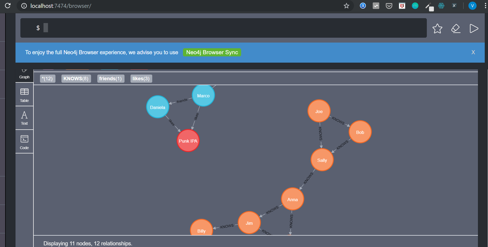

# Tutorial Neo4j

Tutorial para entender a ferramenta chamada Neo4j, um banco de dados que utiliza grafos para otimizar bancos SQL e NOSQL ou aproveitar estes dados para fazer análises em tempo real dos mesmos.

## Como saber se você precisa do Neo4j

A vantagem de utilizar um banco de dados com grafos é que seus dados estarão organizados de forma totalemente diferente do que em uma forma relacional convencional ou não relacional.

Neo4j é uma ferramenta muito poderosa utilizada por diversas empresas que possuem uma grande massa de dados. Dessa forma elas manipulam seu dados em forma de um modelo de grafos que possuem relações em que as bases SQL e NOSQL não conseguiriam observar.  

## SQL

No caso de um banco relacional, temos por exemplo o seguinte diagrama: 

Ao observar as tabelas, é necessário saber quais tabelas são de relacionamento e qual o fluxo dos dados caso alguém deseje fazer uma pesquisa. Neste caso utiliza-se o JOIN para juntar tabelas e conseguir fazer buscas. Entretanto, quando os dados começam a ficar muito grandes normalmente é preciso realizar muitos joins, o que além de deixar as queries longas, praticamente só quem está trabalhando nelas possui o conhecimento do modelo. 

## Grafos

Já no Neo4j, o diagrama ficaria mais ou menos da seguinte forma:

Agora com os grafos , mesmo para um número gigantesco deles o comportamento do banco de dados será mais eficaz do que o banco relacional, pois a velocidade de deslocamento dos grafos é muito maior do que realizar dezenas de joins. 
Além de simplificar o modelo relacional, o modelo de grafos ainda é considerado ACID que garante a atomicidade, consistência, isolamento, durabilidade, dos dados em condições de transação.  Fazendo com que dados sensíveis sejam passíveis de serem armazenados no Neo4j. 

## Neo4J 

    É necessário ter o Java instalado para conseguir rodar o Neo4j. A versão 8.0 já é o suficiente. 
    Além disso o Neo4j suporta drivers para várias linguaguens, neste exemplo usamos o driver para Python.

    O site para a instalação básica é :
        https://neo4j.com/download-center/#community

## Guia de instalação Windows 

#### Primeiro Passo:

    Instalar Neo4j Community edition

    Utilizar a versão Community Server! Não será possível com outra versão.

    

OBS: Colocar de preferência em ~\ 

### Segundo passo: 

    Ajustar as variáveis de ambiente 

**Criar no path** 
```bash
%NEO4J_HOME% = ~\neo4j-community-3.5.12\bin
```
### Rodar em qualquer prompt: neo4j console


### Terceiro passo: 

    -> Acessar o console pelo browser 

    -> Rodar o console em qualquer promt: neo4j console 

    -> Como ele está habilitado na porta 7474 do localhost, acessar: 
        http:// http://localhost:7474/browser/ 
    -> No dashboard o usuário e senha que deverão ser colocados, por padrão são:

    username: neo4j  
    senha: neo4j 
     

**Depois da primeira conexão, ainda no dash, aparecerá a opção de alterar a senha: coloque sua nova senha.** 

### Quarto passo: 

    -> Testar um script em python usando neo4jbolt na porta 7687 

    -> Rode o arquivo neo4j_example.py. Lembre-se de alterar a senha que foi criada no passo anterior. 


## Mac OSx

#### Primeiro Passo:

    -> Instalar Neo4j Community edition

    -> Utilizar a versão Community Server! Não será possível com outra versão. 

    -> Se desejar é possível instalar o neo4j por meio do brew com o comando:

 ```bash
 $ brew install neo4j
 ```

 #### Segundo passo:
    
    Utilizar o comando no terminal 
 ```bash
 $ neo4j start
 ```

### Caso o neo4j for reconhecido corretamente ele irá abrir um dashboard no localhost: http://localhost:7474/browser/ a partir dai segue o tutorial do Windows com os usuários e senhas.
### Caso ele não tenha sido reconhecido tente alterar as variáveis de ambiente no .bash_profile 

     


OBS: Colocar de preferência em ~\ 

## Instalação no Linux

### -> Guia instalação neo4j ubuntu:

    Fazer o download do neo4j community edition .tar


    Fazer o tar -xvf do arquivo

### Configurar o seu ambiente local
    Editar o .bashrc:
    export PATH=$PATH:\ 
    /home/...../neo4j-community-2.3.0

Agora podemos usar o comando neo4j console e rodar o servidor

## **Caso dê algum erro, verifique:**
    -> Verifique que as pastas extraidas do arquivo tar estão no local certo: coloque "certificates", "conf", "data", "import", "lib", "logs", "plugins", "run" e "tools" dentro da pasta $NEO4J_HOME/bin.


	-> Sua instalação do java como dito inicialmente

## Depois disso seguir os passos do windows.

    


## Exemplo com Cypher

Para exemplificar a utilização do Cypher que é a linguagem para o banco de dados em grafo, foi feito um pequeno modelo com suporte do driver para a linguaguem Python. Como mostra o trecho a seguir :

 ```python
 from neo4j.v1 import GraphDatabase, basic_auth

driver = GraphDatabase.driver("bolt://localhost", auth=basic_auth("neo4j", "admin"))
session = driver.session()

# Insert data
insert_query = '''
UNWIND {pairs} as pair
MERGE (p1:Person {name:pair[0]})
MERGE (p2:Person {name:pair[1]})
MERGE (p1)-[:KNOWS]-(p2)
'''

data = [["Jim","Mike"],["Jim","Billy"],["Anna","Jim"],
          ["Anna","Mike"],["Sally","Anna"],["Joe","Sally"],
          ["Joe","Bob"],["Bob","Sally"]]

session.run(insert_query, parameters={"pairs": data})

# Friends of a friend

foaf_query = '''
MATCH (person:Person)-[:KNOWS]-(friend)-[:KNOWS]-(foaf) 
WHERE person.name = {name}
  AND NOT (person)-[:KNOWS]-(foaf)
RETURN foaf.name AS name
'''

results = session.run(foaf_query, parameters={"name": "Joe"})
for record in results:
    print(record["name"])


# Common friends

common_friends_query = """
MATCH (user:Person)-[:KNOWS]-(friend)-[:KNOWS]-(foaf:Person)
WHERE user.name = {user} AND foaf.name = {foaf}
RETURN friend.name AS friend
"""

results = session.run(common_friends_query, parameters={"user": "Joe", "foaf": "Sally"})
for record in results:
    print(record["friend"])

# Connecting paths

connecting_paths_query = """
MATCH path = shortestPath((p1:Person)-[:KNOWS*..6]-(p2:Person))
WHERE p1.name = {name1} AND p2.name = {name2}
RETURN path
"""

results = session.run(connecting_paths_query, parameters={"name1": "Joe", "name2": "Billy"})
for record in results:
    print (record["path"])


session.close()
 
 ```

## Análise do código

Primeiro vamos ver qual o resultado gerado pelo código e analisar ponto a ponto do código.



Com a imagem podemos ver que duas redes foram geradas, é possível observar que os nós possuem os nomes das pessoas, as arestas possuem a relação que cada uma delas possui. A rede que está em azul foi formada por outro código que é bem simples e pode ser mostrado posteriormente. 

## Conectando com o localhost

Para conseguir a conexão com o local Host é necessário criar o driver com suas credenciais e também iniciar a sessão desse driver.

 ```python
 from neo4j.v1 import GraphDatabase, basic_auth

driver = GraphDatabase.driver("bolt://localhost", auth=basic_auth("neo4j", "admin"))
session = driver.session()
 ```

 ## Cypher

 Agora vamos ver de fato como as queries funcionam em Cypher, este próximo trecho mostra basicamente a rede formada em laranja.

 ```python
 # Insert data
insert_query = '''
UNWIND {pairs} as pair
MERGE (p1:Person {name:pair[0]})
MERGE (p2:Person {name:pair[1]})
MERGE (p1)-[:KNOWS]-(p2)
'''

data = [["Jim","Mike"],["Jim","Billy"],["Anna","Jim"],
         ["Anna","Mike"],["Sally","Anna"],["Joe","Sally"],
         ["Joe","Bob"],["Bob","Sally"]]

session.run(insert_query, parameters={"pairs": data})

 ```

 Como é possivel observar ele constroi as relações de pares e utiliza a aresta como [KNOWS] que seria se uma pessoa conhece a outra ou não. 
 Já a data em si são os pares que ele da merge na querie, e no final roda-se a sessão com os parâmetros específicos.


## Conexão para formar a rede

 ```python
# Friends of a friend

foaf_query = '''
MATCH (person:Person)-[:KNOWS]-(friend)-[:KNOWS]-(foaf) 
WHERE person.name = {name}
AND NOT (person)-[:KNOWS]-(foaf)
RETURN foaf.name AS name
'''

results = session.run(foaf_query, parameters={"name": "Joe"})
for record in results:
    print(record["name"])
 ```

Baseado na rede laranja criada, esta querie é responsável por criar a relação amigo de amigo e tem como a referência se um par de pessoas se conhece ou não.
 

```python

# Common friends

common_friends_query = """
MATCH (user:Person)-[:KNOWS]-(friend)-[:KNOWS]-(foaf:Person)
WHERE user.name = {user} AND foaf.name = {foaf}
RETURN friend.name AS friend
"""

results = session.run(common_friends_query, parameters={"user": "Joe", "foaf": "Sally"})
for record in results:
    print(record["friend"])
```

Agora este trecho monta a relação de amigos comuns baseado no fato de um usuário conhecer alguém e se ela é amigo de outro amigo. Ou seja, ele da um MATCH entre as arestas que são [KNOWS] E também se a pessoa comparada é amigo de um amigo. 

## Ligando os pontos

```python
# Connecting paths

connecting_paths_query = """
MATCH path = shortestPath((p1:Person)-[:KNOWS*..6]-(p2:Person))
WHERE p1.name = {name1} AND p2.name = {name2}
RETURN path
"""

results = session.run(connecting_paths_query, parameters={"name1": "Joe", "name2": "Billy"})
for record in results:
    print (record["path"])


session.close()
```

Este último pedaço do código liga os caminhos baseado em um par de pessoas e se elas se conhecem ou não. 


 


# Referências

  Os exemplos de tipos de dados relacionais e grafos
https://www.youtube.com/watch?v=NO3C-CWykkY 
