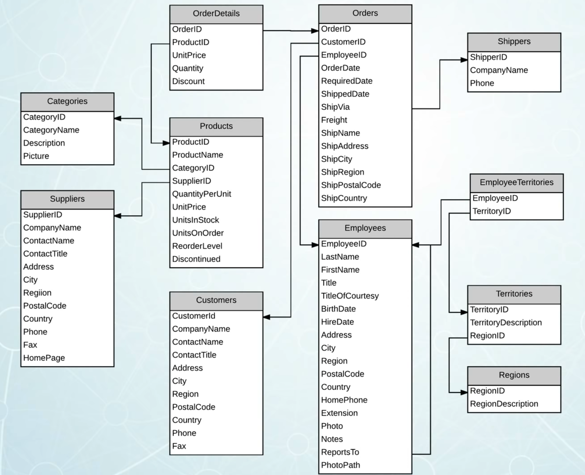
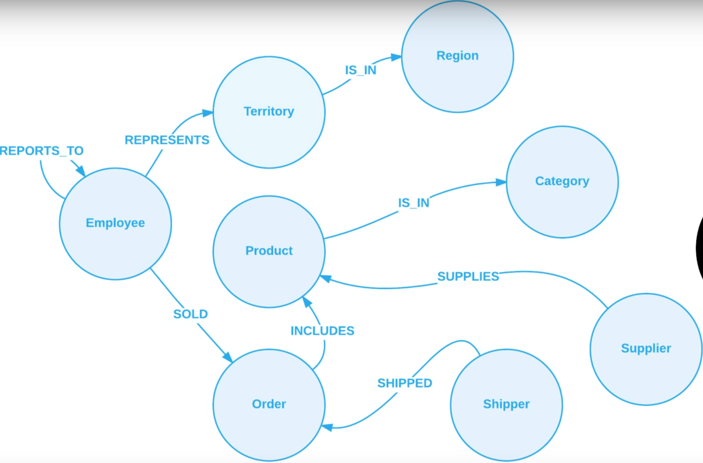

# Tutorial Neo4j

Tutorial para entender a ferramenta chamada Neo4j, um banco de dados que utiliza grafos para otimizar bancos SQL e NOSQL ou aproveitar estes dados para fazer análises em tempo real destes dados.

## Como saber se você precisa do Neo4j

Neo4j é uma ferramenta muito poderosa utilizada por diversas empresas que possuem muitos dados e gostariam de otimizar suas análises sobre os mesmos.

A vantagem de utilizar um banco de dados com grafos é que seus dados estarão organizados de forma totalemente diferente do que em uma forma relacional convencional ou não relacional.

## SQL

No caso de um banco relacional, temos por exemplo o seguinte diagrama: 

Ao observar as tabelas, é necessário saber quais tabelas são de relacionamento e qual o fluxo dos dados caso alguém deseje fazer uma pesquisa. Neste caso utiliza-se o JOIN para juntar tabelas e conseguir fazer buscas. Entretanto, quando os dados começam a ficar muito grandes normalmente é preciso realizar muitos joins, o que além de deixar as queries longas, praticamente só quem está trabalhando nelas possui o conhecimento do modelo. 

## Grafos

Já no Neo4j, o diagrama ficaria mais ou menos da seguinte forma:

Agora com os grafos , mesmo para um número gigantesco deles o comportamento do banco de dados será mais eficaz do que o banco relacional, pois a velocidade de deslocamento dos grafos é muito maior do que realizar dezenas de joins. 
Além de simplificar o modelo relacional, o modelo de grafos ainda é considerado ACID que garante a atomicidade, consistência, isolamento, durabilidade, dos dados em condições de transação.  Fazendo com que dados sensíveis sejam passíveis de serem armazenados no Neo4j. 

## Neo4J – Guia de instalação Windowns e Mac OSx

Primeiro Passo:

Instalar Neo4j Community edition 

OBS: Colocar de preferência em ~\ 

Segundo passo: Ajustar as variáveis de ambiente 

OBS: Vai facilitar muito sua vida nos próximos passos 

Criar no path %NEO4J_HOME% = ~\neo4j-community-3.5.12\bin 

A partir disso, rodar em qualquer prompt: neo4j console 

Terceiro passo: Acessar o console pelo browser 

Rodar o console em qualquer promt: neo4j console 

Como ele está habilitado na porta 7474 do localhost, acessar: 

http:// http://localhost:7474/browser/ 

A senha padrão definida é neo4j e o user neo4j, use-os para logar no dashboard. 

Depois da primeira conexão, ainda no dash, aparecerá a opção de alterar a senha: coloque sua nova senha. 

Quinto passo: Testar um script em python usando neo4jbolt na porta 7687 

Rode o arquivo neo4j_example.py. Lembre-se de alterar a senha que foi criada no passo anterior. 

# Referências

  Os exemplos de tipos de dados relacionais e grafos
https://www.youtube.com/watch?v=NO3C-CWykkY 
